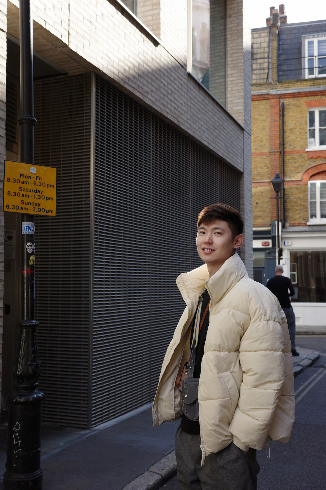

Hello, I’m Weiyi. 

I’m a web developer based in Toronto. I love creating and designing for the web, where I can blend my passion for aesthetic arts with my interest in technology. This combination allows me to craft digital experiences that are not only functional but also visually engaging.

When I’m not in front of a screen, you’ll find me exploring nature on trails, skiing, or capturing moments through photography. I’m also deeply interested in movies and travel—all of which inspire my creative work.

This is my personal blog, where I’ll be sharing my thoughts, ideas, and experiences. Thanks for stopping by!

{:style="width: 50%; margin: 0 auto;"}

{:.image-caption}

*A moment on a London street, UK*
{:style="text-align: center;"}

{::comment}
{:style="margin:50 auto"}

{:.image-caption}

*A view of Castillo de San Cristobal in San Juan, Puerto Rico. Photo by Weiyi*
{:/comment}

You can reach me by email: weywu(at)outlook.com 
