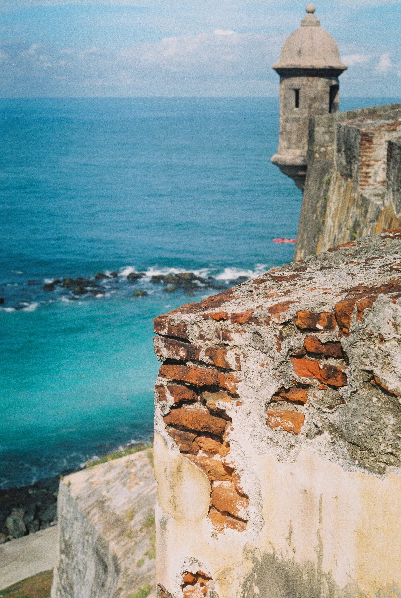

Hello, I’m Weiyi. 

I'm a web developer based in Toronto. Originally from China, educated in US and Canada. I enjoy designing and working things on web. When I'm off screen, you can find me either walking trails, ski or in the kitchen inventing some new taste great. I also love movies travel and photography. This site is my personal blog, I'll share my thoughts and some ideas here in the future.  

{:style="margin:0 auto"}

{:.image-caption}

*Me on the street in London, UK. Photo by Weiyi's fiancée Jin*

{:style="margin:0 auto"}

{:.image-caption}

*A view of Castillo de San Cristobal in San Juan, Puerto Rico. Photo by Weiyi*

You can reach me by email: weywu(at)outlook.com 
